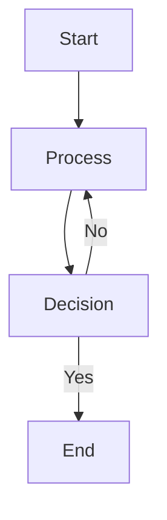

# Process Maps Module - Summary

## Overview
A complete Odoo 17 Community module for managing and displaying process maps with easy employee access and manager editing capabilities.

## Module Structure

```
process_maps/
├── __init__.py
├── __manifest__.py
├── README.md
├── INSTALLATION.md
├── MODULE_SUMMARY.md
├── data/
│   └── ir_model_data.xml          # Model definitions for security
├── models/
│   ├── __init__.py
│   └── process_map.py              # Main models (ProcessMap, Category, Tag, ChangeLog)
├── security/
│   ├── ir.model.access.csv        # Access rights (employees read, managers full access)
│   └── process_map_security.xml    # Record rules for filtering
├── views/
│   ├── process_map_views.xml       # Form, List, Kanban, Search views
│   └── menu_views.xml              # Menu items
└── static/
    └── src/
        ├── css/
        │   └── process_map.css     # Custom styling
        ├── js/
        │   └── process_map_widget.js  # Diagram rendering widget
        └── xml/
            └── process_map_widget.xml  # Widget template
```

## Key Features Implemented

### ✅ Employee Access
- Easy menu access: **Process Maps > All Processes**
- View published process maps
- Search and filter capabilities
- Multiple view types (Kanban, List, Form)
- Access tracking (view count)

### ✅ Manager Capabilities
- Full CRUD operations on all process maps
- Quick edit interface
- Version control
- Change logging
- Status management (Draft → Published → Archived)

### ✅ Process Map Features
- Multiple diagram types: Mermaid, BPMN, Flowchart, Image
- Rich HTML descriptions
- Categorization and tagging
- Department association
- Project linking
- Version tracking
- Automatic change logging

### ✅ Security
- Employees: Read-only access to published processes + own drafts
- Managers: Full access to all processes
- Record rules automatically filter based on user role

## Models Created

1. **process.map** - Main process map model
2. **process.map.category** - Process categories
3. **process.map.tag** - Process tags
4. **process.map.change.log** - Change history tracking

## Views Created

1. **Form View** - Comprehensive form with tabs:
   - Diagram tab (with diagram display)
   - Description tab (HTML editor)
   - Related Information tab (projects, tags)
   - Change History tab (audit trail)

2. **List View** - Sortable table with key information

3. **Kanban View** - Visual cards grouped by category

4. **Search View** - Advanced filtering and grouping options

## Installation

1. Copy module to Odoo addons directory
2. Update Apps List in Odoo
3. Install "Process Maps" module
4. Start creating process maps!

See `INSTALLATION.md` for detailed steps.

## Usage Workflow

### For Employees:
1. Navigate to **Process Maps > All Processes**
2. Browse or search for processes
3. Click to view details and diagram
4. Access count automatically increments

### For Managers:
1. Navigate to **Process Maps > All Processes**
2. Create new or edit existing processes
3. Add diagram (Mermaid syntax recommended)
4. Set version and publish
5. Changes automatically logged

## Diagram Support

### Mermaid (Recommended)


### BPMN
Enter BPMN XML format

### Image
Upload PNG/JPG image files

## Next Steps for Enhancement

Potential future improvements:
- [ ] Export process maps to PDF
- [ ] Integration with workflow automation
- [ ] Process map templates
- [ ] Approval workflow for process changes
- [ ] Process map analytics dashboard
- [ ] Mobile app support
- [ ] Process map comparison (version diff)
- [ ] Embed process maps in other Odoo modules

## Technical Notes

- Uses Odoo 17's new framework (OWL components)
- Mermaid library loaded from CDN (requires internet)
- Change logging is automatic on create/update
- Version format validation (X.Y or X.Y.Z)
- Responsive design for mobile access

## Support & Customization

The module is designed to be easily extensible:
- Add custom fields by inheriting `process.map` model
- Customize views by inheriting existing views
- Modify security rules as needed
- Add custom diagram types by extending the widget

## License
LGPL-3 (Open Source)
