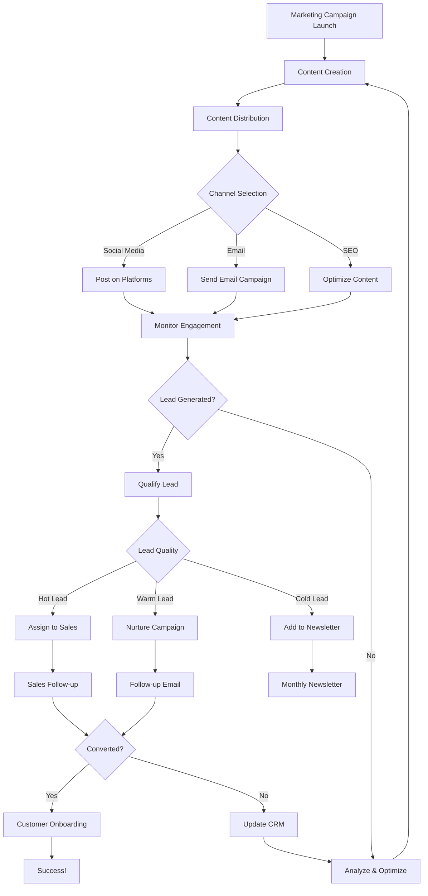
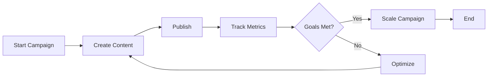
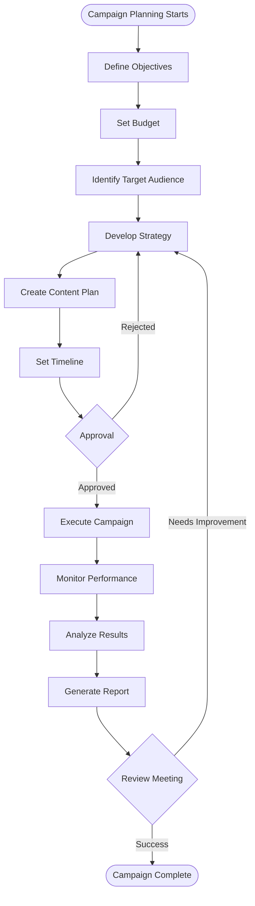

# Sample Diagrams for Process Maps Module

## Marketing Process - Lead Generation & Conversion

### Mermaid Diagram Data
Copy this into the "Diagram Data" field when creating a process map:



### Alternative: Simple Marketing Workflow



### Marketing Campaign Planning Process



## How to Use These Diagrams

1. **Create a new Process Map** in Odoo
2. **Set Diagram Type** to "Mermaid"
3. **Copy one of the diagram codes above** (without the ```mermaid wrapper)
4. **Paste into the "Diagram Data" field**
5. **Save and Publish**

## Example Process Map Setup

- **Name**: Marketing Lead Generation Process
- **Category**: Marketing
- **Version**: 1.0
- **Diagram Type**: Mermaid
- **Diagram Data**: (paste the first diagram code above)
- **Description**: This process outlines our marketing lead generation and conversion workflow from campaign launch to customer onboarding.
